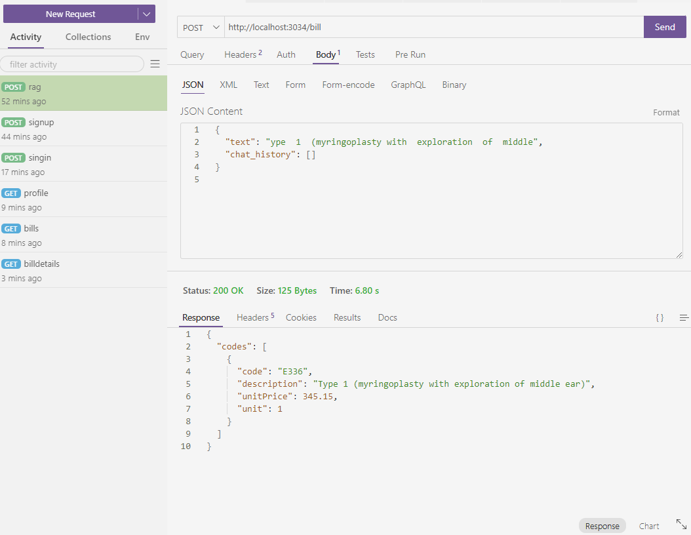
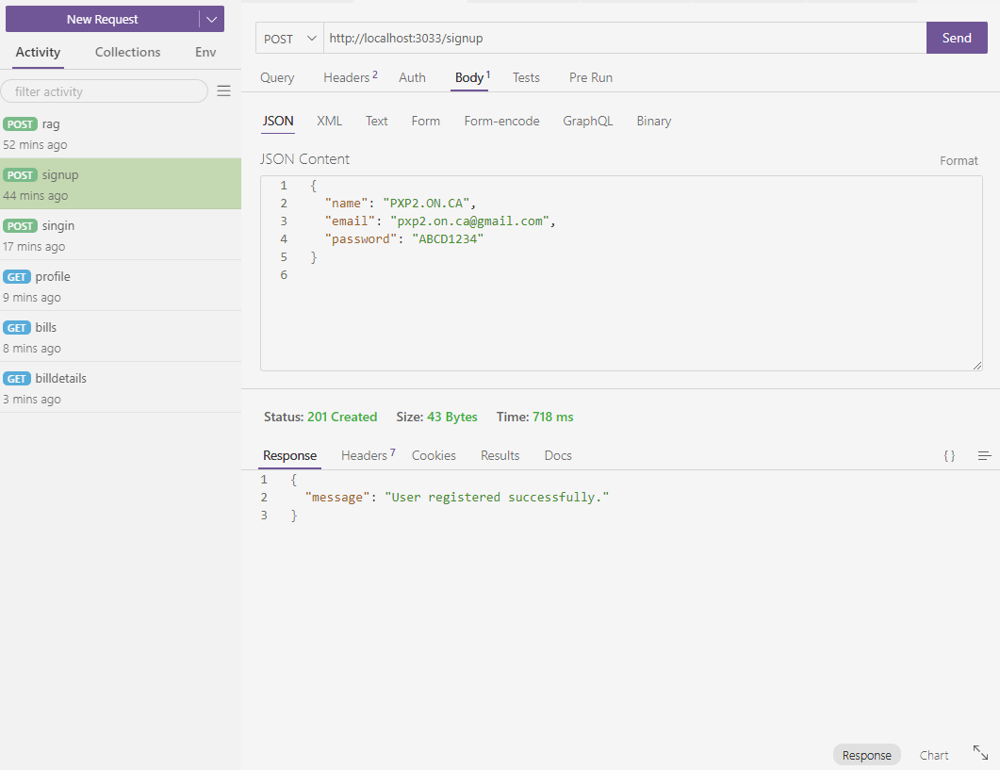
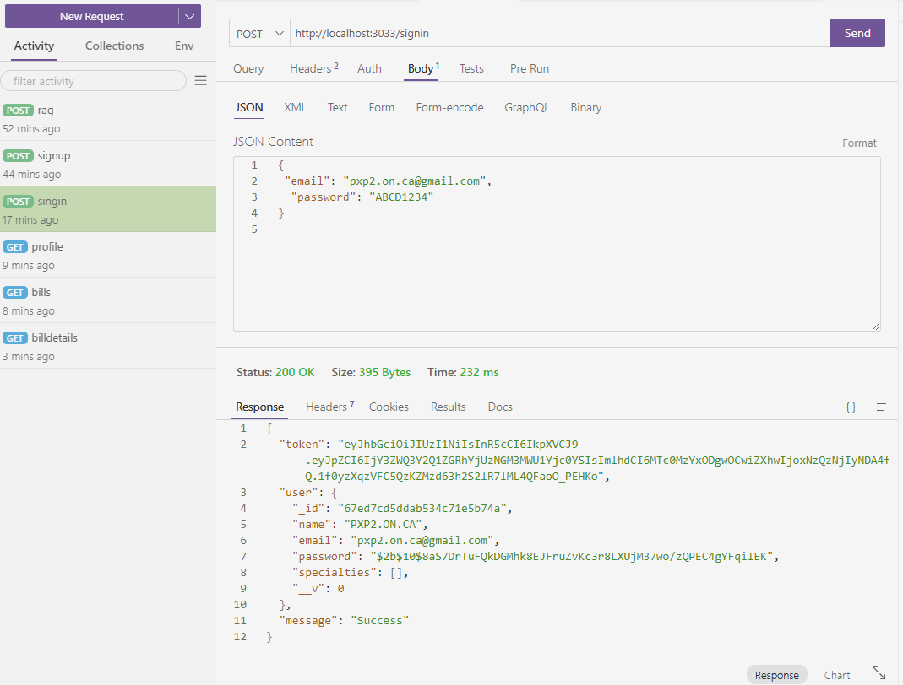
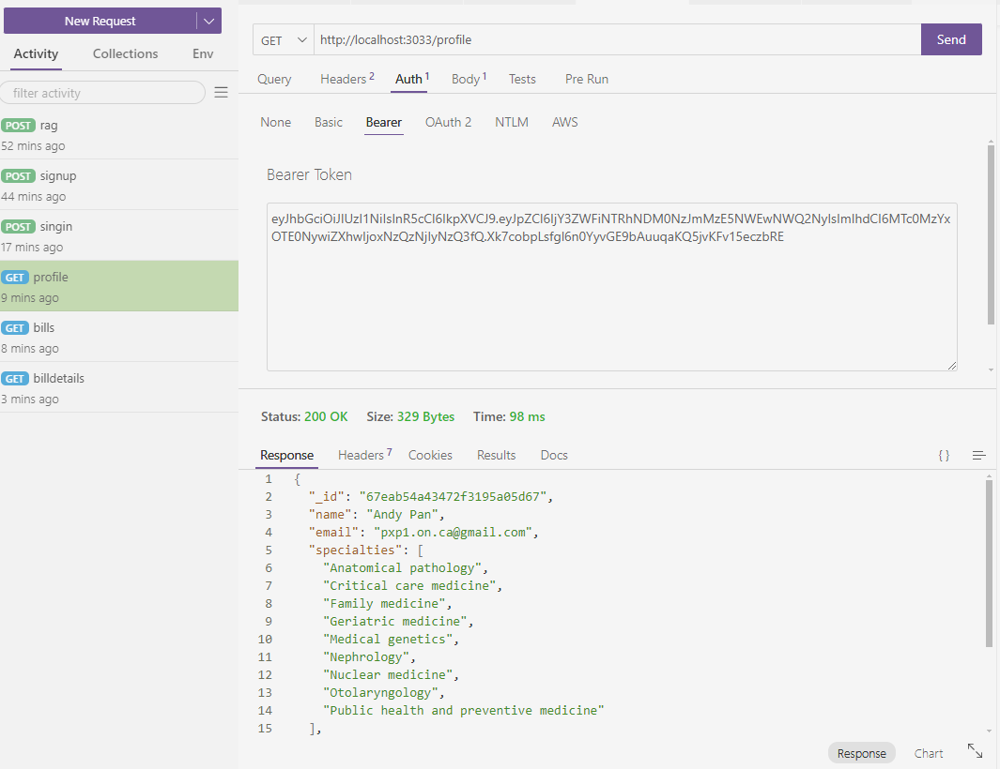
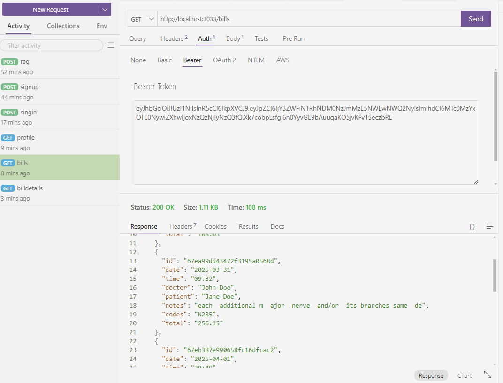
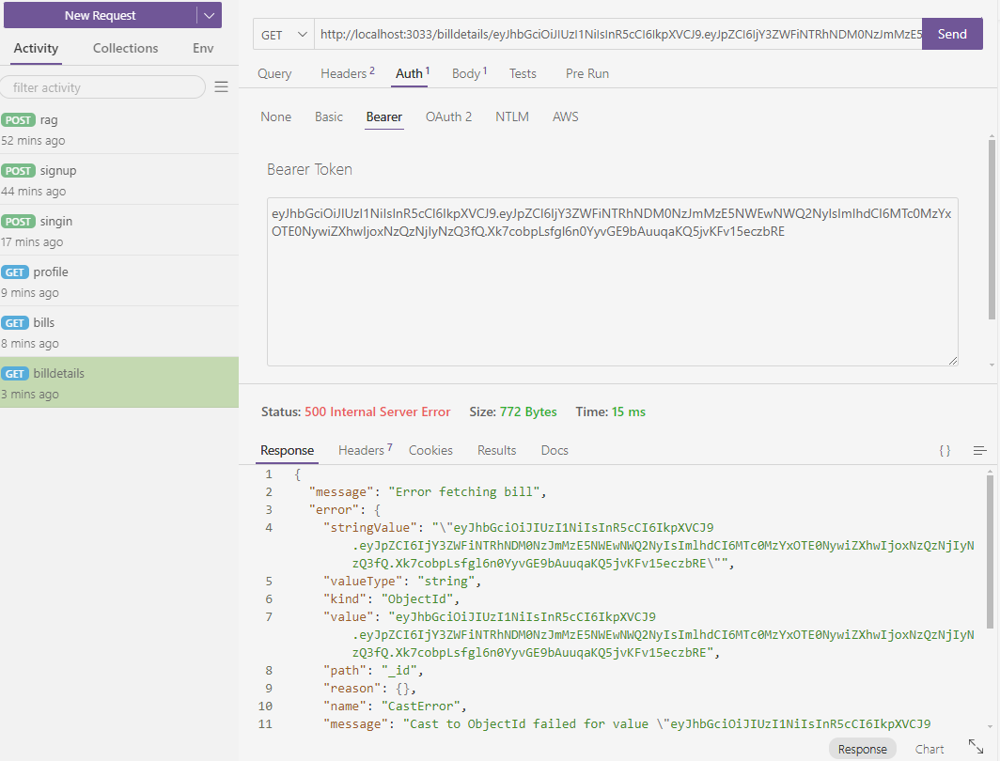

# Medical AI Billing Assistant

**How to configure backend**

In \backend\, create .env with the following parameters:
```
MONGODB_URI=mongodb+srv://admin:?@cluster0.c8ols.mongodb.net/MernMedicalAiAssistant?retryWrites=true&w=majority&appName=Cluster0
JWT_SECRET=secretkey
OPENAI_API_KEY=?
PINECONE_API_KEY=?
```
Note to change the keys accordingly

**How to run backend**

\- Node (index.js for CRUD)
```cmd
cd backend 
npm run start
```

\- Python (index.py for RAG, open another terminal)
```cmd
cd backend
python -m uvicorn index:app --host 0.0.0.0 --port 3034 --reload
```

**How to configure frontend**

In \frontend, create .env with the following parameters:
```
VITE_NODE_API=http://localhost:3033
VITE_PYTHON_API=http://localhost:3034
```
Note to change the APIs accordingly.


**How to run frontend**

Note to run ```npm run build``` if you are deploying
```cmd
cd frontend
npm run dev
```

**How to test the backend**

Note the backend is tested using vscode Thunder Client plugin.

\- RAG<br>


\- Signup<br>


\- Signin<br>


\- Profile<br>


\- Bills<br>


\- Bill Details<br>

